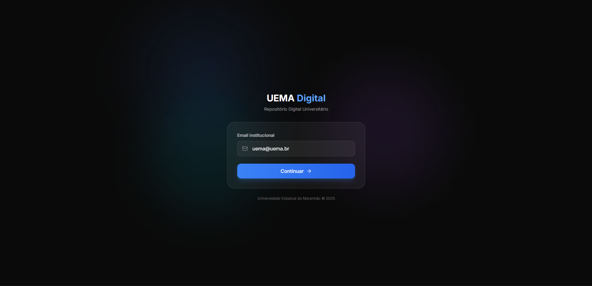

# hello :) 

## Run Locally

**Prerequisites:**  Node.js

1. Install dependencies:
   `npm install`
2. Set the `VITE` in [.env.local](.env.local) to your Gemini API key
3. Run the app:
   `npm run dev`
