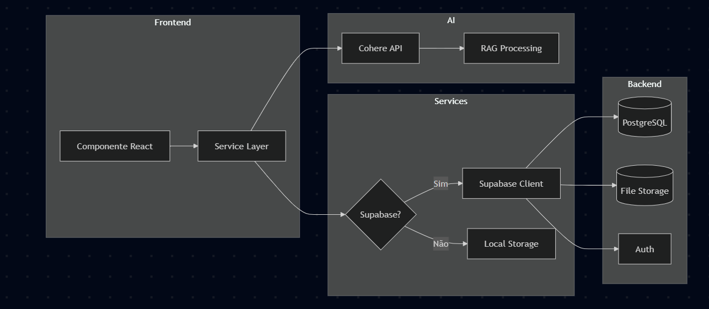

# Arquitetura do Sistema - UEMA Digital

## Visão Geral

O sistema utiliza arquitetura **JAMstack** (JavaScript, APIs, Markup) com:
- Frontend SPA (Single Page Application)
- Backend as a Service (Supabase)
- IA como serviço (Cohere API)

## Diagrama de Arquitetura


## Fluxo de Dados



## Stack Tecnológica

### Frontend
| Tecnologia | Versão | Uso |
|------------|--------|-----|
| React | 18.x | UI Framework |
| TypeScript | 5.x | Tipagem estática |
| Vite | 6.x | Build tool |
| Framer Motion | 11.x | Animações |
| Recharts | 2.x | Gráficos |
| Lucide React | - | Ícones |

### Backend (Supabase)
| Serviço | Uso |
|---------|-----|
| PostgreSQL | Banco de dados |
| Auth | Autenticação |
| Storage | Arquivos |
| Realtime | Notificações |
| Edge Functions | Serverless |

### IA
| Serviço | Uso |
|---------|-----|
| Cohere API | Chat e RAG |
| Text extraction | PDFs e DOCXs |

## Padrões de Design

### Estrutura de Pastas
```
uema-digital-repo/
├── app/              # Configurações Expo (mobile)
├── components/       # Componentes reutilizáveis
├── features/         # Módulos por funcionalidade
│   ├── auth/         # Login/Registro
│   ├── chat/         # Assistente IA
│   ├── dashboard/    # Painel inicial
│   ├── documents/    # Gestão de documentos
│   ├── processes/    # Gestão de processos
│   ├── reports/      # Relatórios
│   └── settings/     # Configurações
├── services/         # Camada de serviços
│   ├── supabase.ts   # Cliente Supabase
│   ├── storage.ts    # Persistência
│   └── ai.ts         # Integração Gemini
├── docs/             # Documentação
├── tests/            # Testes
└── DBA/              # Scripts SQL
```

### Princípios Aplicados
- **Separação de Responsabilidades**: Features isoladas
- **Single Source of Truth**: Supabase como fonte única
- **Fail Gracefully**: Fallback para localStorage
- **Progressive Enhancement**: Funciona sem IA
