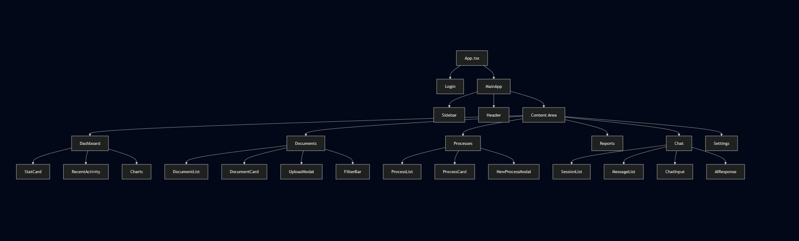
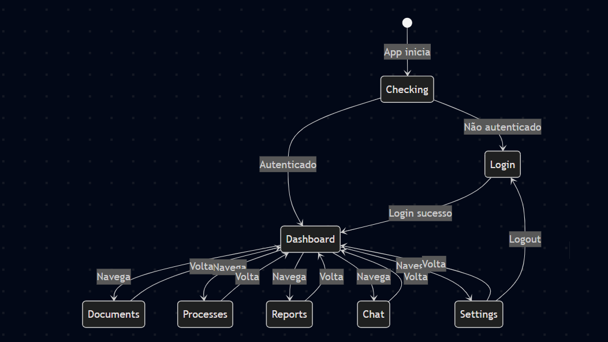
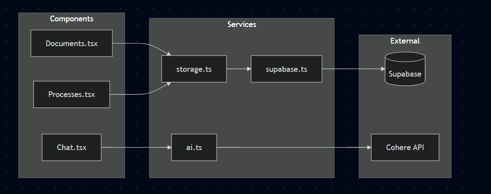

# Estrutura de Componentes - UEMA Digital

## Hierarquia de Componentes



## Componentes Principais

### App.tsx
```typescript
// Componente raiz que gerencia autenticação
interface AppState {
  isAuthenticated: boolean;
  currentUser: User | null;
  currentView: ViewState;
}
```

### Componentes de UI Reutilizáveis

| Componente | Props | Descrição |
|------------|-------|-----------|
| StatCard | title, value, icon, trend | Card de estatística |
| Button | variant, size, loading | Botão estilizado |
| Modal | isOpen, onClose, title | Modal genérico |
| FilterBar | filters, onChange | Barra de filtros |
| DataTable | data, columns | Tabela de dados |
| Toast | message, type | Notificação |

## Fluxo de Estado



## Padrão de Comunicação


## Estrutura de Features

Cada feature segue o padrão:

```
features/
└── [feature-name]/
    ├── index.ts          # Exports
    └── [FeatureName].tsx # Componente principal
```

### Exemplo: Documents

```typescript
// features/documents/Documents.tsx
export const Documents: React.FC = () => {
  // Estado local
  const [documents, setDocuments] = useState<Document[]>([]);
  const [loading, setLoading] = useState(true);
  const [filter, setFilter] = useState({ sector: '', status: '' });
  
  // Efeitos
  useEffect(() => {
    loadDocuments();
  }, [filter]);
  
  // Renderização
  return (
    <div>
      <FilterBar />
      <DocumentList />
      <UploadModal />
    </div>
  );
};
```

## Integração com Services


