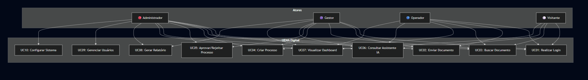

# Diagrama de Casos de Uso - UEMA Digital

## Visão Geral
Diagrama mostrando os atores e principais funcionalidades do sistema.

## Legenda de Atores

| Ator | Papel | Permissões |
|------|-------|------------|
| 🔴 Administrador | Acesso total | Todas as funcionalidades |
| 🟣 Gestor | Gerente de setor | Documentos, processos, relatórios |
| 🔵 Operador | Usuário comum | Criar documentos e processos |
| ⚪ Visitante | Apenas leitura | Visualizar e consultar IA |
