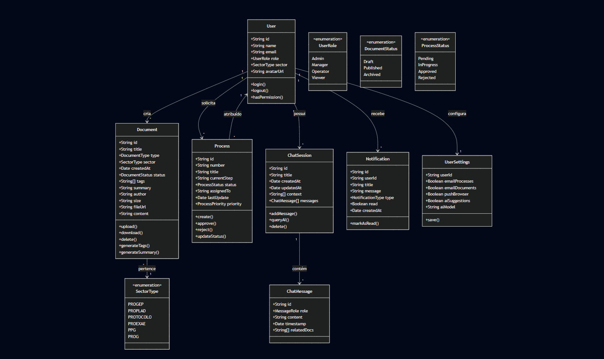

# Diagrama de Classes - UEMA Digital

## Modelo de Domínio

## Descrição das Classes

| Classe | Responsabilidade |
|--------|-----------------|
| User | Representa usuários do sistema |
| Document | Documentos armazenados |
| Process | Processos administrativos |
| ChatSession | Sessões de conversa com IA |
| ChatMessage | Mensagens do chat |
| Notification | Notificações do sistema |
| UserSettings | Configurações do usuário |
