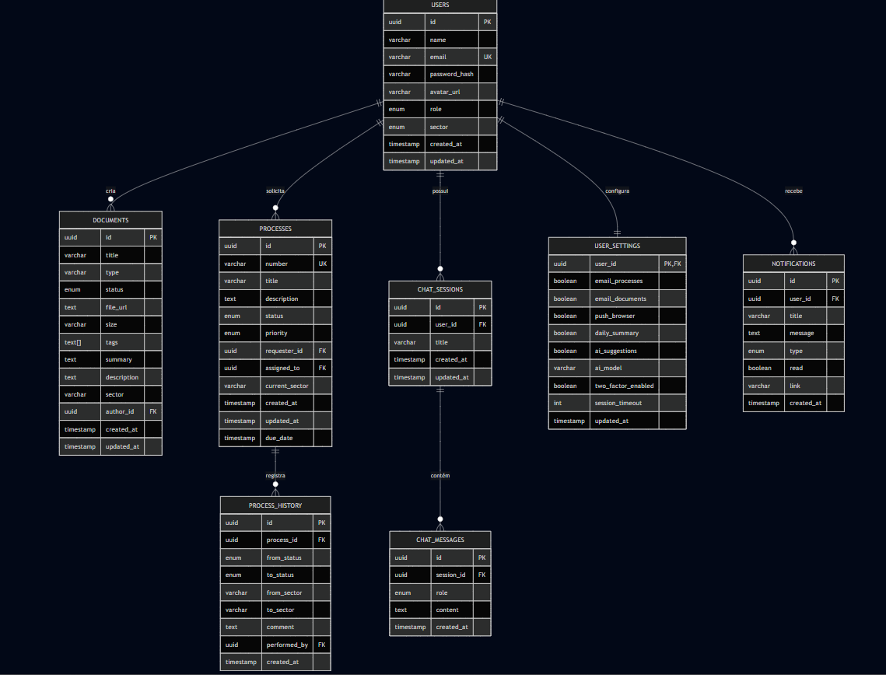

# Diagrama Entidade-Relacionamento (DER) - UEMA Digital

## Modelo Conceitual

## Modelo Físico (PostgreSQL)

### Tabela: users
| Coluna | Tipo | Restrições |
|--------|------|-----------|
| id | UUID | PRIMARY KEY |
| name | VARCHAR(255) | NOT NULL |
| email | VARCHAR(255) | UNIQUE, NOT NULL |
| password_hash | VARCHAR(255) | |
| avatar_url | TEXT | |
| role | ENUM | DEFAULT 'Operator' |
| sector | ENUM | DEFAULT 'PROGEP' |
| created_at | TIMESTAMPTZ | DEFAULT NOW() |
| updated_at | TIMESTAMPTZ | DEFAULT NOW() |

### Tabela: documents
| Coluna | Tipo | Restrições |
|--------|------|-----------|
| id | UUID | PRIMARY KEY |
| title | VARCHAR(500) | NOT NULL |
| type | VARCHAR(10) | NOT NULL |
| status | ENUM | DEFAULT 'Draft' |
| file_url | TEXT | |
| tags | TEXT[] | DEFAULT '{}' |
| summary | TEXT | |
| sector | VARCHAR(50) | |
| author_id | UUID | FK → users.id |
| created_at | TIMESTAMPTZ | DEFAULT NOW() |

### Tabela: processes
| Coluna | Tipo | Restrições |
|--------|------|-----------|
| id | UUID | PRIMARY KEY |
| number | VARCHAR(50) | UNIQUE, NOT NULL |
| title | VARCHAR(500) | NOT NULL |
| status | ENUM | DEFAULT 'Pending' |
| priority | ENUM | DEFAULT 'Medium' |
| requester_id | UUID | FK → users.id |
| assigned_to | UUID | FK → users.id |
| created_at | TIMESTAMPTZ | DEFAULT NOW() |

## Relacionamentos

| Origem | Destino | Cardinalidade | Descrição |
|--------|---------|---------------|-----------|
| users | documents | 1:N | Usuário cria documentos |
| users | processes | 1:N | Usuário solicita processos |
| users | chat_sessions | 1:N | Usuário possui sessões |
| chat_sessions | chat_messages | 1:N | Sessão contém mensagens |
| processes | process_history | 1:N | Processo tem histórico |
